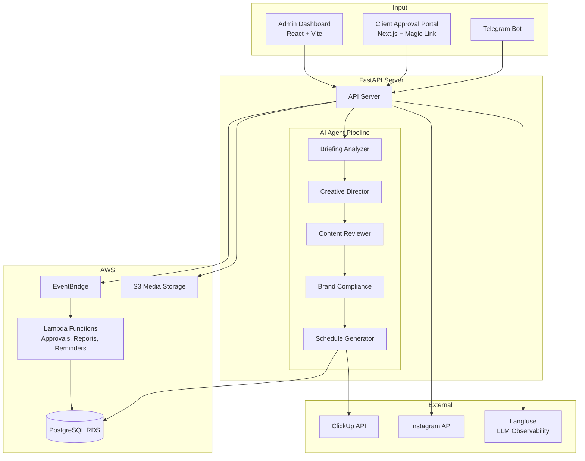

# AI Marketing Orchestrator

AI-powered automation platform for marketing agencies. A **Telegram bot** receives client briefings in natural language and automatically creates structured tasks in ClickUp, with a **client approval portal**, **Instagram analytics**, and **automated monthly reporting**.

## Features

- **Briefing Analysis** -- AI agents parse free-text briefings and extract structured data (client, deliverables, deadlines, priority)
- **Automated Task Creation** -- Creates ClickUp cards with correct naming conventions, subtasks per deliverable, assignees, and tags
- **Rules Engine** -- YAML-based rules for team assignments, client overrides, and workflow routing
- **Client Approval Portal** -- React + Next.js portal with magic link auth for clients to review and approve creative assets
- **Instagram Analytics** -- Automated Instagram insights sync with media and account-level metrics
- **Monthly Reports** -- Auto-generated performance reports with charts (PDF via Lambda)
- **AI Review Team** -- Creative director, content reviewer, and brand compliance agents for internal QA
- **Admin Dashboard** -- Full backoffice UI (React + Vite) for team management, workflows, knowledge base, and notifications
- **Observability** -- Langfuse integration for LLM cost tracking and tracing

## Architecture



## Tech Stack

| Component | Technology |
|-----------|-----------|
| Language | Python 3.12+ |
| Bot | python-telegram-bot (webhook mode) |
| API Server | FastAPI + Uvicorn |
| AI Agents | Agno framework (structured output) |
| LLM | Claude via OpenRouter + Groq |
| Database | PostgreSQL + SQLAlchemy + Alembic |
| Approval Portal | Next.js + Tailwind CSS |
| Admin Dashboard | React + Vite + shadcn/ui |
| Observability | Langfuse (OpenTelemetry) |
| Infrastructure | AWS ECS Fargate, Lambda, RDS, S3, EventBridge |
| IaC | CloudFormation + SAM |
| CI/CD | GitHub Actions |

## Engineering Decisions

| Decision | Rationale |
|----------|-----------|
| **Agno over LangChain/CrewAI** | Agno provides structured outputs with Pydantic validation natively, reducing boilerplate for multi-agent orchestration. Simpler dependency tree and more predictable token usage compared to LangChain's abstraction layers |
| **Multi-agent pipeline over single LLM** | Separating briefing analysis, creative review, and brand compliance into distinct agents allows independent prompt tuning, cost optimization per stage, and parallel execution of non-dependent steps |
| **YAML rules engine over hardcoded logic** | Client-specific routing and team assignments change frequently. YAML configuration enables non-developer stakeholders to modify rules without code deployments |
| **Magic link auth over OAuth for client portal** | Clients reviewing creative assets are non-technical users who need frictionless access. Magic links eliminate password management while maintaining per-session security |
| **EventBridge over SQS for workflow orchestration** | EventBridge provides content-based routing and scheduling natively, enabling time-based triggers (monthly reports, approval reminders) without custom polling infrastructure |
| **Langfuse over custom logging** | Provides OpenTelemetry-compatible LLM observability with cost tracking per agent, latency percentiles, and token usage analytics — critical for optimizing multi-agent costs |
| **CloudFormation + SAM over Terraform** | Lambda functions with EventBridge rules benefit from SAM's native support for serverless resources, while the main infrastructure (ECS, RDS) uses standard CloudFormation |

## Quick Start

```bash
# Clone and install
git clone https://github.com/diego-zetria/ai-marketing-orchestrator.git
cd ai-marketing-orchestrator
pip install -e ".[dev]"

# Configure
cp .env.example .env
# Edit .env with your API keys

# Start PostgreSQL
docker compose up -d

# Run migrations
alembic upgrade head

# Run the bot
python -m src.main
```

## Project Structure

```
ai-marketing-orchestrator/
├── src/
│   ├── agents/              # AI agents (briefing analyzer, creative director, brand compliance, etc.)
│   ├── api/admin/           # Admin backoffice API (FastAPI)
│   ├── approval/            # Client approval portal backend (auth, email, media, WhatsApp)
│   ├── bot/                 # Telegram bot handlers, Instagram sync, reports
│   ├── db/                  # SQLAlchemy models, migrations, repositories
│   ├── engine/              # Rules engine (YAML-based assignment logic)
│   ├── integrations/        # ClickUp, Instagram, S3, EventBridge clients
│   ├── observability/       # Langfuse integration, cost tracking
│   └── config/              # Pydantic settings
├── approval-portal/         # Next.js client approval UI
├── frontend/                # React admin dashboard
├── lambdas/                 # AWS Lambda functions (approval, reports, reminders)
├── infra/                   # CloudFormation + SAM templates
├── config/
│   ├── rules.yaml           # Assignment rules and client overrides
│   └── brands/              # Brand guidelines per client
├── tests/                   # 80+ tests
├── alembic/                 # Database migrations
├── docker-compose.yml
└── pyproject.toml
```

## Rules Configuration

Team assignments and client routing are configured via `config/rules.yaml`:

```yaml
assignment_rules:
  design:
    default_assignees: ["designer_clickup_id"]
    tags: ["design"]
  copy:
    default_assignees: ["copywriter_clickup_id"]
    tags: ["copy"]

client_overrides:
  "Client Name":
    designer: "specific_designer_id"
    list_id: "client_specific_list_id"
```

## AWS Deployment

The platform runs on AWS with:

- **ECS Fargate** -- Bot + API server (ARM64 Graviton)
- **RDS PostgreSQL** -- Persistent storage
- **Lambda** -- Approval processor, report generator, reminders
- **S3** -- Media asset storage
- **EventBridge** -- Event-driven approval workflows
- **GitHub Actions** -- CI/CD pipeline with ECR push and ECS deploy

```bash
# Deploy via CloudFormation
cd infra/
aws cloudformation deploy --template-file cloudformation.yaml --stack-name marketing-bot --capabilities CAPABILITY_IAM
```

## Testing

```bash
# Run all tests
pytest tests/ -v

# With coverage
pytest tests/ -v --cov=src
```

**80+ tests** covering: AI agents, rules engine, ClickUp integration, Telegram handlers, approval workflows, Instagram sync, admin API, and end-to-end flows.

## License

MIT
